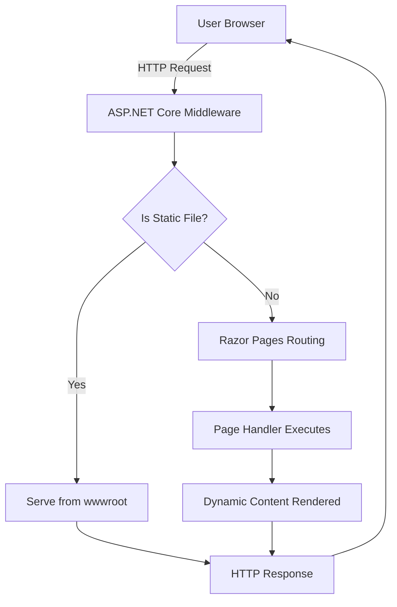

# UrlListApp

UrlListApp is an ASP.NET Core Razor Pages web application designed to serve static and dynamic web content. It is part of the San Antonio GitHub Copilot Global Bootcamp 2025 repository.

## How It Works

- **Framework:** Built with ASP.NET Core Razor Pages, which allows for page-focused web development.
- **Startup:** The app is configured and started in `Program.cs` using the .NET Generic Host.
- **Services:** Razor Pages are registered as the main service, enabling dynamic page rendering.
- **Middleware:**
  - In production, the app uses a custom error handler and enables HTTP Strict Transport Security (HSTS).
  - HTTPS redirection is enforced for security.
  - Routing and authorization middleware are enabled.
- **Static Files:** Static assets (CSS, JS, images) are served using `app.MapStaticAssets()`.
- **Razor Pages:** All user interaction and dynamic content are handled through Razor Pages, which are mapped with `app.MapRazorPages().WithStaticAssets()`.
- **Execution:** The app listens for HTTP requests and serves content accordingly.

## Architecture Diagram



## Usage

1. **Run the App:**
   - Use the .NET CLI to run the application:
     ```bash
     dotnet run --project UrlListApp/UrlListApp.csproj
     ```
2. **Access the App:**
   - Open your browser and navigate to `https://localhost:5001` (or the port specified in your launch settings).
3. **Features:**
   - View and interact with web pages defined in the `Pages/` directory.
   - Access static files from the `wwwroot/` directory.

## Project Structure

- `Pages/` - Contains Razor Pages for dynamic content.
- `wwwroot/` - Contains static files (CSS, JS, images).
- `Program.cs` - Configures and starts the application.
- `appsettings.json` - Configuration files for the app.

## Requirements
- .NET 9.0 SDK or later

## License
This project is part of the San Antonio GitHub Copilot Global Bootcamp 2025 and is intended for educational purposes.
